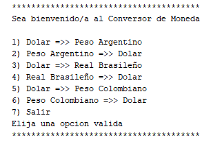
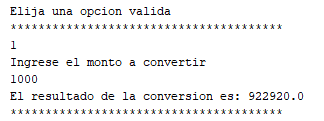
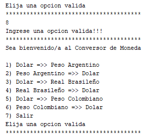
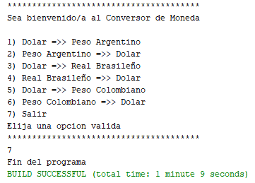

# Conversor de Monedas

Una aplicación de consola que permite convertir diferentes monedas utilizando una API de tipo de cambio.

## Índice

- [Descripción](#descripción)
- [Características](#características)
- [Instalación](#instalación)

## Descripción

Esta aplicación de consola presenta un menú con seis opciones de conversión de monedas y permite a los usuarios ingresar un valor para convertir. 
El programa está diseñado para funcionar en un bucle hasta que el usuario elija salir.



El menú ofrece opciones para convertir entre varias monedas y muestra el resultado de la conversión basada en los datos actuales de una API de tipo de cambio.

## Características

- Conversión entre múltiples monedas.
- Funciona en un bucle para múltiples conversiones.
- Utiliza la API de Exchange Rate para obtener los tipos de cambio actuales.
- Menú interactivo fácil de usar.



## Control de errores

- Se limito el ingreso solo a las opciones valida, arrojando un error de opcion no valida si se ingresa valor fuera del rango o una letra por ejemploentre múltiples monedas.




## Instalación

Para instalar y ejecutar esta aplicación, sigue estos pasos:

```bash
# Clonar el repositorio
git clone https://github.com/tu-usuario/conversor-monedas.git

# Entrar al directorio del proyecto
cd conversor-monedas

# Instalar dependencias (si es necesario)
# Por ejemplo, si estás usando Maven para un proyecto en Java:
mvn install
